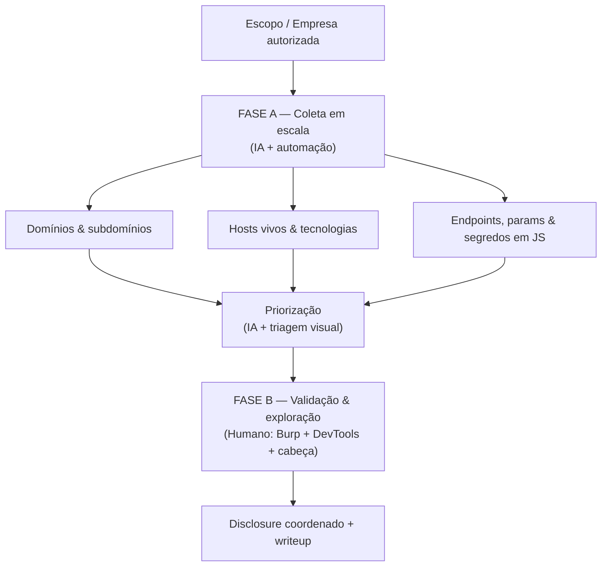

# 🎯 BB-WEB-API ROADMAP v2 — Edição 2026

### Caça a bugs em Web + API, com IA + automação na coleta e cabeça humana na exploração

> **Para quem é:** caçador intermediário que quer se especializar em **web + API** de forma **moderna, contextual e em escala**. Não é trilho — é mapa. Adapte prazos à sua vida; **não negocie os princípios**.

Este repositório é um **roadmap completo de Bug Bounty Web + API (edição 2026)** em português: metodologia, motor de recon com IA + automação, trilha de fases F0–F7, playbooks por classe de bug, cenários práticos ponta a ponta, setup do ambiente, cookbook de prompts de IA e técnicas avançadas. A filosofia central: **amplitude por máquina (IA + automação na coleta) → profundidade por humano (validação e exploração manual)**.

---

## ⚠️ Aviso ético (leia antes de tudo — e releia em cada fase)

Este material descreve técnicas **ofensivas** exclusivamente para uso **autorizado**: seus próprios labs, programas de bug bounty e engajamentos contratados.

- **Escopo é lei.** Você só testa o que o programa autoriza, exatamente como autoriza. Sem programa e sem contrato, **não há autorização**.
- **Automação não é desculpa para DoS.** Recon massivo respeita *rate limits*; nunca derrube um alvo.
- **IA não recebe dados sensíveis de alvos.** Jamais cole PII, credenciais, segredos ou código proprietário sob NDA em modelos de terceiros (veja a [seção de IA no motor de recon](01-recon/recon-engine-ia-e-automacao.md)).
- **PoC de impacto mínimo + disclosure coordenado.** Prove o bug com o menor dano possível e divulgue só **após a correção**.
- 🇧🇷 No Brasil, acesso não autorizado é crime (**Lei 12.737/2012**, "Lei Carolina Dieckmann"); dados pessoais são regidos pela **LGPD**. Fora isso: **CFAA** (EUA), **Computer Misuse Act** (Reino Unido).

> Acesso técnico **não** é permissão. A linha entre pesquisa e crime é a **autorização** — nunca a sua habilidade ou curiosidade. Detalhamento completo em [Ética e compromissos](05-referencia/arsenal-labs-checklists-etica.md#-ética-e-compromissos).

---

## 📂 Estrutura do repositório

Este roadmap foi repartido em seções temáticas para caber a densidade sem virar um paredão ilegível. Leia na [ordem sugerida](#-como-usar-este-repositório), mas use como **referência** — você vai voltar no [motor de recon](01-recon/recon-engine-ia-e-automacao.md), na [referência/ética](05-referencia/arsenal-labs-checklists-etica.md), no [playbook de classes de bug](03-playbooks/classes-de-bug.md) e no [setup + cookbook de IA](05-referencia/setup-completo-e-cookbook-ia.md) o tempo todo.

| Seção | Documento | Conteúdo | Quando usar |
|---|---|---|---|
| 🏠 **Hub** | **`README.md`** *(este)* | Visão geral, metodologia 2026, pilares, 4 frentes, mapa das fases | Comece aqui |
| [**01 · Recon**](01-recon/) | [Recon Engine: IA + Automação](01-recon/recon-engine-ia-e-automacao.md) | ⭐ O motor: descoberta de domínios/subdomínios/endpoints, análise de JS, pipelines, **IA aplicada ao recon e à caça** | A base de tudo; consulta constante |
| [**01 · Recon**](01-recon/) | [Recon Contínuo + API Avançado](01-recon/recon-continuo-e-api-avancado.md) | Recon **contínuo/monitoramento**, frameworks, cloud, templates Nuclei, API avançada | Escalar e automatizar |
| [**02 · Trilha**](02-trilha/) | [Fundação + Web (F0·F1·F2)](02-trilha/01-fundacao-e-web-f0-f2.md) | F0 (setup/mindset/pipeline) · F1 (fundação técnica) · F2 (web — o coração) | Fases iniciais e centrais |
| [**02 · Trilha**](02-trilha/) | [API Bug Bounty (F3)](02-trilha/02-api-f3.md) | F3 (API: OWASP API Top 10 2023, REST, GraphQL) + recon de API | Especialização em API |
| [**02 · Trilha**](02-trilha/) | [CTF · CVE · Carreira (F4–F7)](02-trilha/03-ctf-cve-carreira-f4-f7.md) | F4 (CTF) · F5 (CVE hunting) · F6 (carreira/conversão) · F7 (consolidação) | Frentes paralelas e conversão |
| [**03 · Playbooks**](03-playbooks/) | [Playbook de Classes de Bug](03-playbooks/classes-de-bug.md) | 🔬 Aprofundamento de **cada classe de bug** (server-side, client-side, autz/lógica) com metodologia e exemplos | Quando atacar um endpoint |
| [**03 · Playbooks**](03-playbooks/) | [Técnicas Avançadas e Cadeias](03-playbooks/tecnicas-avancadas-e-cadeias.md) | 🧠 **Encadeamento** de bugs, **bypass de WAF**, SSRF/XSS/auth/cache avançados, 2ª ordem | Nível expert |
| [**03 · Playbooks**](03-playbooks/) | [Orange Tsai Decodificado (foco JS)](03-playbooks/orange-tsai-decodificado-js.md) | 🧭 A **metodologia do Orange Tsai** traduzida para o **ecossistema JavaScript** (Node, parsers, proxies, prototype pollution) + panteão de pesquisadores | A lente de research; leia após as classes |
| [**04 · Prática**](04-pratica/) | [Cenários Práticos](04-pratica/cenarios-praticos.md) | 🎯 **Metodologia aplicada ponta a ponta** em 6 cenários reais de alvo | Para ver tudo junto na prática |
| [**05 · Referência**](05-referencia/) | [Arsenal · Labs · Checklists · Ética](05-referencia/arsenal-labs-checklists-etica.md) | Arsenal completo, reading list, labs, checklist final, ética e anti-padrões | Referência e auditoria |
| [**05 · Referência**](05-referencia/) | [Setup Completo + Cookbook de IA](05-referencia/setup-completo-e-cookbook-ia.md) | ⚙️ Instalação/config de **todo o arsenal** + **cookbook de prompts de IA** + cheat-sheet por classe | Montar o ambiente e usar IA |
| [**05 · Referência**](05-referencia/) | [Apêndices Práticos](05-referencia/apendices.md) | Glossário, plano dos **primeiros 90 dias**, cronograma, FAQ, **modelo de report** | Operação do dia a dia |

---

## 🧭 A metodologia 2026: amplitude por máquina, profundidade por humano

A versão antiga deste roadmap pregava "manual primeiro, scanner depois". **Isso mudou.** Caçar só no manual em 2026 é deixar 90% da superfície de ataque sem mapear enquanto o programa recebe centenas de outros olhos. A inversão correta:

- **FASE A — Coleta em escala (máquina: IA + automação).** Objetivo: mapear 100% da superfície de ataque, rápido. `domínios → subdomínios → hosts vivos → tecnologias → endpoints → parâmetros → segredos em JS → superfície de API`. A IA ajuda a: gerar wordlists contextuais, parsear JS gigante, resumir output massivo, escrever scripts sob medida, criar templates Nuclei, priorizar o que olhar primeiro.
- **FASE B — Validação + exploração (humano: Burp + DevTools + cabeça).** Objetivo: achar e provar o que scanner nenhum acha. `logic flaws · IDOR/BOLA · BAC/BFLA · race conditions · cadeias de bugs · client-side avançado · abuso de fluxo`. A IA entra como copiloto: entender stacks, deobfuscar JS, gerar hipóteses, escrever PoC, redigir o report — nunca decidir só.

### O princípio em uma frase

> **A automação amplia quem já sabe caçar — ela não substitui o saber.** Máquina te dá *onde olhar* (amplitude); o humano descobre *o que está quebrado* (profundidade).

### Por que essa ordem e não a inversa

- **Cobertura.** Um programa grande tem milhares de subdomínios e dezenas de milhares de endpoints. Olho humano não enumera isso; automação enumera em minutos.
- **Foco.** Depois de mapear tudo, IA + filtros te dizem onde estão os alvos suculentos (apps de admin, APIs antigas, endpoints com parâmetros sensíveis), e você gasta sua energia humana só onde vale.
- **Onde está o dinheiro.** Os bugs que pagam — *logic flaws*, IDOR/BOLA, race conditions, cadeias — são **invisíveis para scanner**. Eles exigem contexto, e contexto é humano. Por isso a profundidade nunca terceiriza para a máquina.

### O que **continua** sendo anti-padrão (importante)

Modernizar **não** é virar "automation runner". O erro nunca foi usar ferramenta — o erro é:

- ❌ **Parar na automação** e mandar output bruto de scanner sem validar → duplicata, N/A, reputação queimada.
- ❌ **Automatizar sem entender** o que cada ferramenta faz por baixo.
- ❌ **Confiar na IA cegamente** (alucinação) ou **vazar dados de alvo** para modelos de terceiros.

A regra de ouro continua: **toda exploração e todo report passam por validação manual e contextual.** A máquina coleta e prioriza; você confirma e explora.

---

## 🏛️ Os 3 pilares operacionais (reformulados para 2026)

Tudo neste roadmap se apoia em três pilares. Eles se sustentam mutuamente — derrubar um derruba a casa.

### Pilar 1 — Leitura ativa de writeups (3–5 por semana, inegociável)

Quem não lê o que os outros acharam reinventa a roda e nunca aprende os padrões que se repetem. Leitura ativa = ler **entendendo o mecanismo** e se perguntando "eu teria achado isso? como?". Fontes principais: [Pentester.land](https://pentester.land/list-of-bug-bounty-writeups.html), [HackerOne Hacktivity](https://hackerone.com/hacktivity), [InfoSec Writeups](https://infosecwriteups.com), [PortSwigger Research](https://portswigger.net/research).

### Pilar 2 — Prática deliberada (lab → caça real)

Você não aprende a achar bug lendo sobre bug. Aprende quebrando lab e depois caçando de verdade, dentro de escopo. Sequência sagrada: **lab → writeup → alvo autorizado**. Detalhe dos labs em [Laboratórios recomendados](05-referencia/arsenal-labs-checklists-etica.md#-laboratórios-recomendados).

### Pilar 3 — Pipeline híbrido: máquina coleta, humano explora

O pilar novo. Você opera com um **pipeline de recon automatizado e assistido por IA** que entrega superfície, e uma **disciplina de validação manual** que transforma superfície em bugs. Dominar **Burp + DevTools + cabeça** continua sendo inegociável — é onde a profundidade acontece. O motor completo está em [Recon Engine: IA + Automação](01-recon/recon-engine-ia-e-automacao.md).

> **Regra de ouro:** **ESTUDA → AUTOMATIZA A COLETA → VALIDA E EXPLORA MANUALMENTE → POSTA.** A máquina entra entre o estudar e o explorar; o posta fecha o ciclo e constrói reputação.

---

## 🧱 As 4 frentes paralelas

Você não avança em série — toca quatro frentes ao mesmo tempo, em proporções que mudam por fase.

| Frente | O que é | Por que importa |
|---|---|---|
| **1. BB principal (web + API)** | Sua caça central em programas reais, com o pipeline híbrido | É o objetivo. Gera bugs, dinheiro e reputação. |
| **2. CTF (web/API)** | Desafios competitivos de web e API | Treina criatividade e classes que raramente aparecem "de graça" na caça. |
| **3. Conteúdo / pipeline pública** | Blog + perfil + GitHub com writeups e ferramentas | Constrói autoridade, atrai convites privados e abre portas de carreira. |
| **4. CVE lateral (OSS)** | Code review de open source → CVE próprio | Diversifica, gera CVEs no currículo e afia leitura de código (turbinada por IA). |

**Por que paralelas:** travou na caça? Vai pro CTF. CTF cansou? Escreve um writeup. Sem ideia? Faz code review de um OSS. As frentes se alimentam — uma técnica de CTF vira bug real; um bug real vira conteúdo; conteúdo abre programa privado.

> **Bug bounty é o centro (a renda); CTF + labs são o acelerador.** Não são trilhas separadas nem "iguais": o **bounty é o objetivo** — alvo real, impacto, dinheiro. **CTF e labs tipo [Hack The Box](https://www.hackthebox.com)** existem para te deixar **mais rápido**, treinar **misturar/encadear vulnerabilidades** e **escalar** num ambiente controlado — e então você leva essa velocidade e esse repertório de cadeias para o alvo real. O **loop**: acelera no CTF/HTB → aplica no bounty (renda) → vira writeup/pesquisa → volta mais afiado. Operacionalizado na [F4 — CTF + Labs a serviço do Bug Bounty](02-trilha/03-ctf-cve-carreira-f4-f7.md#-f4--ctf--labs-a-serviço-do-bug-bounty-velocidade-cadeias-e-escalonamento), com o mapa **categoria de CTF ↔ classe de bug ↔ superfície real**.

> **A bússola de research: Orange Tsai.** O norte metodológico deste roadmap é pensar como o [Orange Tsai](03-playbooks/orange-tsai-decodificado-js.md) — **arquitetura, diferenciais entre parsers/componentes e cadeias de exploração**, não payloads isolados — com todo o foco técnico **pivotado para o ecossistema JavaScript** (Node.js, front-end moderno, npm). Comece pelas classes de bug; volte a essa lente quando quiser subir de "acha bug" para "descobre superfície".

---

## 🗺️ Visão geral das fases (F0 → F7)

> Prazos são **indicativos** para ~15–20h/semana. Capacidade demonstrada > tempo decorrido.

| Fase | Tema | Duração aprox. | Badge |
|---|---|---|---|
| **F0** | Setup + Mindset + Pipeline pública + **base de automação** | 2–3 semanas | 🥚 *Iniciado* |
| **F1** | Fundação técnica (HTTP, JS, Python, SQL, arquitetura web) | 4–8 semanas | 🐣 *Fundado* |
| **F2** | ⭐ Web BB Modern (recon aplicado + Burp + classes web) | 3–6 meses | 🦅 *Caçador Web* |
| **F3** | API Bug Bounty (OWASP API Top 10 2023, REST, GraphQL) | 2–4 meses | 🛰️ *Caçador de API* |
| **F4** | CTF Player (web/API) | contínuo | 🚩 *Competidor* |
| **F5** | CVE Hunting lateral (code review OSS + IA) | contínuo a partir da F2 | 🧬 *Pesquisador* |
| **F6** | Carreira + Conversão (4 rotas, BR/USD) | a partir de resultados | 💼 *Profissional* |
| **F7** | Consolidação (cadência sustentável, anti-burnout) | permanente | 🏔️ *Veterano* |

**Resultados-alvo por fase** (o que comprova que você passou):

- **F0:** lab montado + pipeline de recon mínimo rodando + blog/perfil no ar.
- **F1:** 3 scripts próprios no GitHub (recon/automação) + fundamentos sólidos.
- **F2:** 1º bug aceito em programa real, achado por validação manual sobre superfície automatizada.
- **F3:** crAPI + VAmPI + DVGA fechados + 1 teste de API em alvo real.
- **F4:** repo `ctf-writeups` ativo (≥3 CTFs).
- **F5:** 1º CVE próprio publicado.
- **F6:** material de conversão pronto + 1ª conversa real de oportunidade.
- **F7:** cadência semanal que você mantém sem maratona.

---

## 🧑‍🏫 Como usar este repositório

A ordem de leitura sugerida preserva a progressão pedagógica original, mesmo com os arquivos repartidos em pastas temáticas:

1. **`README.md`** *(este)* — metodologia e mapa.
2. [01 · Recon Engine: IA + Automação](01-recon/recon-engine-ia-e-automacao.md) — o motor de coleta.
3. [02 · Fundação + Web (F0·F1·F2)](02-trilha/01-fundacao-e-web-f0-f2.md) — a base e o coração.
4. [02 · API Bug Bounty (F3)](02-trilha/02-api-f3.md) — especialização em API.
5. [02 · CTF · CVE · Carreira (F4–F7)](02-trilha/03-ctf-cve-carreira-f4-f7.md) — frentes paralelas e conversão.
6. [05 · Arsenal · Labs · Checklists · Ética](05-referencia/arsenal-labs-checklists-etica.md) — referência e auditoria.
7. [03 · Playbook de Classes de Bug](03-playbooks/classes-de-bug.md) — como quebrar cada classe.
8. [01 · Recon Contínuo + API Avançado](01-recon/recon-continuo-e-api-avancado.md) — escala e continuidade.
9. [05 · Apêndices Práticos](05-referencia/apendices.md) — operação do dia a dia.
10. [04 · Cenários Práticos](04-pratica/cenarios-praticos.md) — tudo junto, ponta a ponta.
11. [05 · Setup Completo + Cookbook de IA](05-referencia/setup-completo-e-cookbook-ia.md) — montar o ambiente e usar IA.
12. [03 · Técnicas Avançadas e Cadeias](03-playbooks/tecnicas-avancadas-e-cadeias.md) — nível expert.
13. [03 · Orange Tsai Decodificado (foco JS)](03-playbooks/orange-tsai-decodificado-js.md) — a **lente de research** que reorganiza tudo: arquitetura, diferenciais de parser e cadeias, pivotados para o ecossistema JavaScript.

> **A diferença entre quem lê isto e quem vira caçador de verdade é uma só: fazer.** Suba um lab, rode seu primeiro funil de recon em um alvo autorizado e leia um writeup hoje. Boa caçada. 🎯

---

## 📄 Licença

Material **educacional, para uso exclusivamente autorizado**, licenciado sob [CC BY-SA 4.0](LICENSE). Veja também o [aviso ético](#-aviso-ético-leia-antes-de-tudo--e-releia-em-cada-fase) e a [Ética e compromissos completa](05-referencia/arsenal-labs-checklists-etica.md#-ética-e-compromissos). O uso fora de escopo autorizado é responsabilidade exclusiva de quem praticar.

---

[⬆️ Topo](#) · [Próximo: 01 · Recon Engine: IA + Automação ➡️](01-recon/recon-engine-ia-e-automacao.md)
